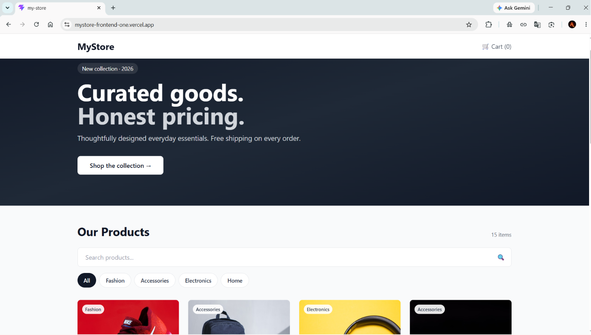
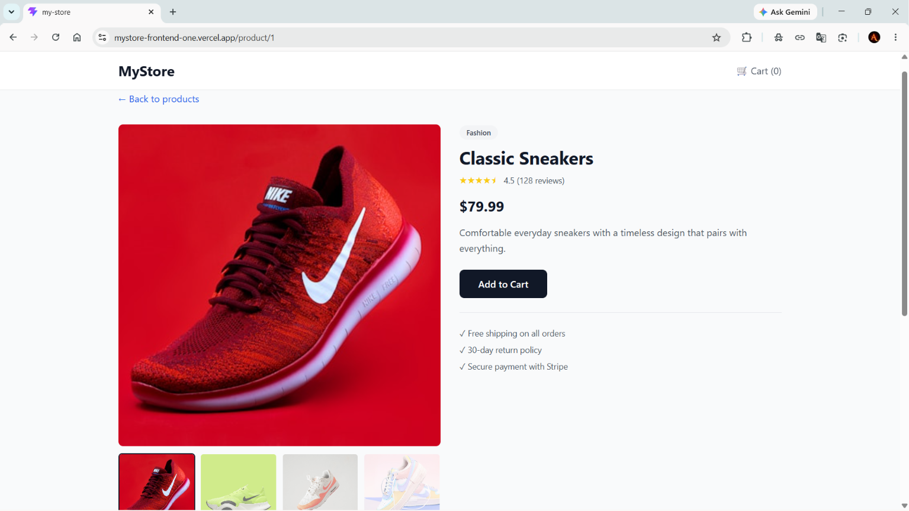
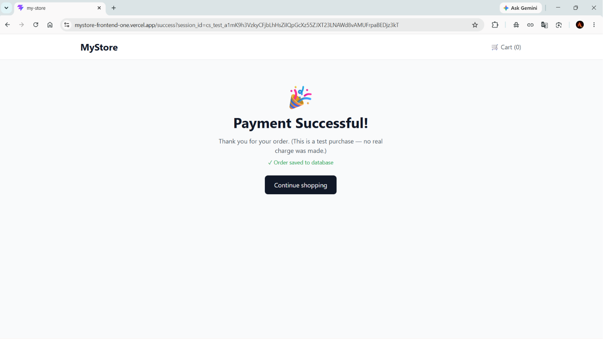

# 🛒 MyStore — Full-Stack E-Commerce Platform

> A production-ready e-commerce web app with Stripe payments, a persistent shopping cart, product reviews, and a real cloud database. Built end-to-end and deployed live.

### 🌐 [Live Demo →](https://mystore-frontend-one.vercel.app)


> ⚠️ **Note on the first load:** The backend is hosted on Render's free tier, which spins down after inactivity. The very first request after a long pause may take **30–60 seconds** to wake the server. Subsequent requests are instant.

---

## ✨ Features

- 🏪 **15-product catalog** across 4 categories (Fashion, Accessories, Electronics, Home)
- 🔍 **Live search** with instant filtering as you type
- 🏷️ **Category filter** that combines with search
- 🖼️ **Image gallery** with clickable thumbnails on every product page
- ⭐ **Star ratings and reviews** — users can write their own reviews (persisted locally)
- 🛒 **Persistent shopping cart** — survives page refresh via localStorage
- 💳 **Stripe Checkout integration** — real (test mode) payment flow with hosted checkout
- 💾 **Cloud database persistence** — every successful payment is saved as an order in MongoDB
- 🍞 **Toast notifications** for user actions
- 📱 **Fully responsive** — works on mobile, tablet, and desktop
- 🎨 **Polished UI** with a gradient hero, hover animations, and clean design

---

## 🧰 Tech Stack

**Frontend** (this repo)
- **React 19** with **Vite** for fast builds and HMR
- **React Router** for client-side routing
- **Tailwind CSS** for utility-first styling
- **React Context + custom hooks** for global state (cart, toasts)
- **localStorage** for cart and review persistence

**Backend** ([see mystore-backend](https://github.com/Abhishekbit775/mystore-backend))
- Node.js + Express
- Stripe SDK
- MongoDB Atlas + Mongoose

**Deployment**
- **Vercel** (frontend) · **Render** (backend) · **MongoDB Atlas** (database)

---

## 📸 Screenshots

### Home page — hero banner & product catalog


### Product detail — image gallery, reviews & ratings


### Payment successful — Stripe checkout completed


---

## 🗂️ Project Structure

```
src/
├── components/
│   ├── Header.jsx           # Navigation with live cart counter
│   ├── Hero.jsx             # Landing-page hero banner
│   ├── ProductCard.jsx      # Grid card with category badge + stars
│   ├── ImageGallery.jsx     # Product image gallery with thumbnails
│   ├── SearchAndFilter.jsx  # Search bar + category pills
│   ├── Stars.jsx            # Reusable star-rating display
│   └── Reviews.jsx          # Review list + submission form
├── context/
│   ├── CartContext.jsx      # Global cart state with localStorage
│   └── ToastContext.jsx     # Toast notification system
├── pages/
│   ├── HomePage.jsx         # Catalog with search + filtering
│   ├── ProductPage.jsx      # Product detail + reviews
│   ├── CartPage.jsx         # Cart management + Stripe checkout
│   └── SuccessPage.jsx      # Post-payment landing + order persistence
├── products.js              # Product catalog data
└── App.jsx                  # Routes + global providers
```

---

## 🚀 Running Locally

### Prerequisites
- Node.js (LTS version recommended)
- The [backend repo](https://github.com/Abhishekbit775/mystore-backend) running locally on port `4242`

### Setup

```bash
# 1. Clone the repo
git clone https://github.com/Abhishekbit775/mystore-frontend.git
cd mystore-frontend

# 2. Install dependencies
npm install

# 3. Create a `.env.local` file pointing to your local backend
echo "VITE_API_URL=http://localhost:4242" > .env.local

# 4. Start the dev server
npm run dev
```

Then open **http://localhost:5173**.

### Testing the checkout

Use Stripe's test card on the checkout page:

| Field | Value |
|---|---|
| Card number | `4242 4242 4242 4242` |
| Expiry | any future date (e.g., `12/30`) |
| CVC | any 3 digits (e.g., `123`) |
| ZIP | any |

No real money changes hands.

---

## 🧠 What I Learned Building This

- Architecting a **full-stack application** with separate frontend/backend repos
- Managing global state in React with **Context API + custom hooks** without external libraries
- Integrating a **third-party payment provider (Stripe)** safely — handling redirect flows, session verification, and metadata limits
- Connecting Node.js to a **cloud database (MongoDB Atlas)** with proper environment variables and connection security
- Configuring **environment variables** to switch behavior between local dev and production
- Deploying a multi-service app: **Vercel** for static frontend, **Render** for the Node backend, **MongoDB Atlas** for the database
- Solving **real production issues** — Stripe's metadata size limit, SPA routing on Vercel (`vercel.json`), CORS, and cold-start latency

---

## 🗺️ Roadmap

Planned upgrades:
- [ ] User authentication (signup/login)
- [ ] Order history page for logged-in users
- [ ] Admin dashboard (view all orders, edit products)
- [ ] Wishlist / favorites
- [ ] Product variants (size, color)

---

## 📬 Connect

**Abhishek Kumar** — built this project end-to-end as a portfolio piece.

- 💼 [LinkedIn](https://www.linkedin.com/in/abhishek-kumar-b5a08a1b3/)
- 🐙 [GitHub](https://github.com/Abhishekbit775)
- 🌐 [Live Site](https://mystore-frontend-one.vercel.app)

Open to feedback and opportunities — feel free to reach out!

---

## 📄 License

MIT — feel free to fork and adapt.
